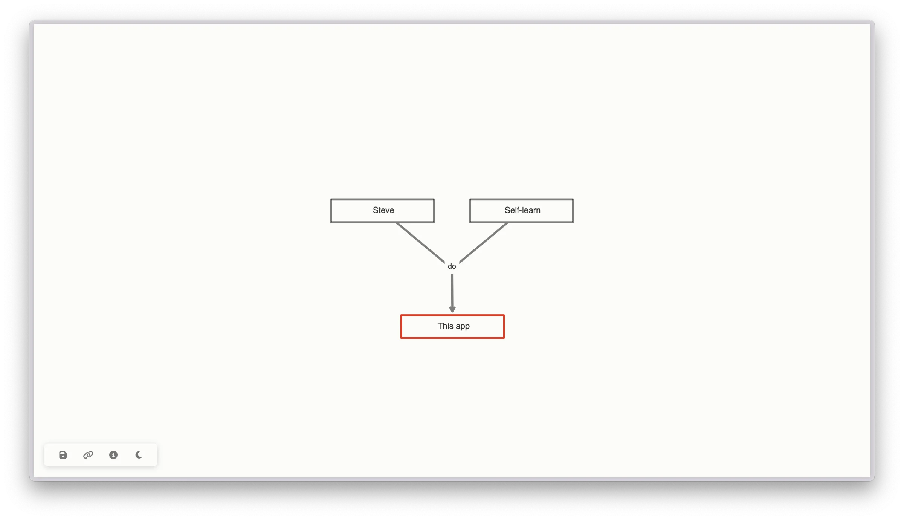

- To create a premise or objection: Double-click on the screen.
- To create a link between an argument (premise or objection) and an idea: Drag and drop the argument onto the idea.
- To create linked premises: Drag and drop each premise onto the conclusion, then one premise onto the other.
- To navigate through the argument: Tab key.
- To edit an element: Enter or Double-click on the element.
- To delete an element: Delete or Backspace key.
- Mouse: You can move or zoom on the argument.
- Undo: Cmd+Z
- To save: Click on <i class="fas fa-save"></i>
- To share: Click on <i class="fas fa-link"></i> to get the URL of the argument.

