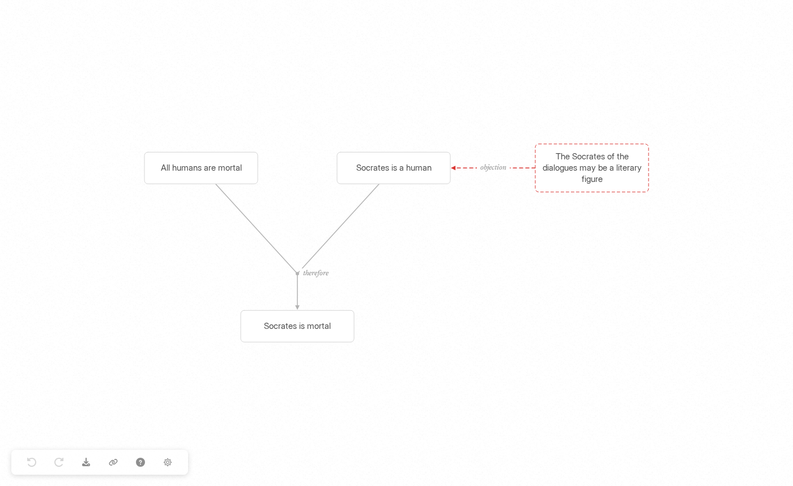

# Think Why?

Map an argument. Lay out premises, objections and a conclusion, link them by dragging, then share the whole map as a link or save it as an image.



Built with [Svelte 5](https://svelte.dev) and [Vite](https://vite.dev) on an ES-module port of [Reasons.js](https://github.com/davekinkead/reasons) by Dave Kinkead. No runtime dependencies: one small script, one stylesheet, self-hosted fonts, and a canvas.

## Use it

| Do this                                                                | To                                                               |
| ---------------------------------------------------------------------- | ---------------------------------------------------------------- |
| Double-click empty space                                               | Add an idea                                                      |
| Double-click an idea or a link                                         | Edit it, make it a premise or an objection                       |
| Drag an idea onto another                                              | Link them                                                        |
| Drag it back the other way                                             | Link both ways                                                   |
| Double-click a link                                                    | Name it, turn it around, or take one premise out of a joint link |
| Drag each premise onto the conclusion, then one premise onto the other | Make them argue together                                         |
| Drag the background                                                    | Pan                                                              |
| Scroll or pinch                                                        | Zoom                                                             |

| Keys                                                                       | Action                   |
| -------------------------------------------------------------------------- | ------------------------ |
| <kbd>Tab</kbd> / <kbd>Shift</kbd> <kbd>Tab</kbd>                           | Move through the ideas   |
| <kbd>Enter</kbd>                                                           | Edit the selected idea   |
| <kbd>Delete</kbd> / <kbd>Backspace</kbd>                                   | Delete the selected idea |
| <kbd>Cmd</kbd> <kbd>Z</kbd> / <kbd>Shift</kbd> <kbd>Cmd</kbd> <kbd>Z</kbd> | Undo / redo              |
| Arrow keys                                                                 | Nudge the selected idea  |
| <kbd>+</kbd> <kbd>-</kbd> <kbd>0</kbd>                                     | Zoom in, out, fit        |
| <kbd>Esc</kbd>                                                             | Deselect                 |

Three-finger swipes undo and redo on touch screens.

The map is saved in the browser as you go. **Copy link** compresses the whole map into the address, so anyone with the link opens the same argument; links made with the previous version keep working. **Save as image** renders the map to a PNG in the current theme. Everything else lives in the floating menu: undo, redo, save as image, copy link, help, and the light/dark switch. The theme follows the system until you flip it, as on [stevehoang.com](https://stevehoang.com).

## Develop

```bash
npm i             # once
npm run dev       # Vite dev server
npm run build     # production build into dist
npm run preview   # serve dist
npm run qc        # lint, svelte-check, unit tests, build, end-to-end tests
npm test          # unit tests (Vitest)
npm run test:e2e  # end-to-end tests (Playwright, needs `npx playwright install chromium`)
```

- `src/lib/reasons/` is the engine: the graph model, the geometry, the canvas view, the pointer and keyboard interaction, and the mapper that ties them together with undo and redo.
- `src/lib/` holds the app state, theme, storage, share links and icons; `src/components/` the Svelte UI; `src/app.css` the design tokens.
- `tests/unit/` covers the engine and the share and storage logic; `tests/e2e/` drives the built app on desktop and mobile viewports.

Commits follow [Conventional Commits](https://www.conventionalcommits.org): commitlint checks the message and husky runs lint, svelte-check and the unit tests before every commit. Code carries no comments; names and tests carry the intent.

## Deploy

The build is static. `.gitlab-ci.yml` publishes `dist` to GitLab Pages from `main`; the GitHub Actions workflow runs the full QC on every push and pull request.

## Credits

Reasons.js by Dave Kinkead, University of Queensland (MIT). Icons from [Font Awesome Free](https://fontawesome.com/license/free) (CC BY 4.0). Inter Display and Newsreader under the SIL Open Font License.
